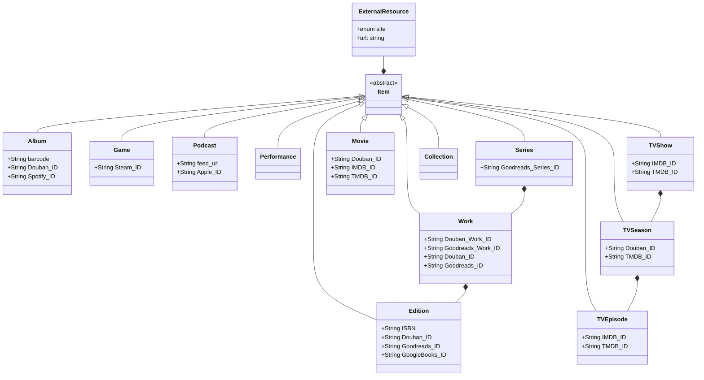

Catalog
=======

Data Models
-----------
all types of catalog items inherits from `Item` which stores as multi-table django model. 
one `Item` may have multiple `ExternalResource`s, each represents one page on an external site

Add a new site
--------------
 - add a new item to `IdType` enum in `catalog/common/models.py`
 - add a new file in `catalog/sites/`, a new class inherits `AbstractSite`, with:
    * `ID_TYPE`
    * `URL_PATTERNS`
    * `WIKI_PROPERTY_ID` (not used now)
    * `DEFAULT_MODEL` (unless specified in `scrape()` return val)
    * a `classmethod` `id_to_url()`
    * a method `scrape()` returns a `ResourceContent` object
    * ...

    see existing files in `catalog/sites/` for more examples
 - add an import in `catalog/sites/__init__.py`
 - add some tests
     + add `DOWNLOADER_SAVEDIR = '/tmp'` to settings can save all response to /tmp
     + move captured response file to `test_data/`, except large/images files. Or if have to, use a smallest version (e.g. 1x1 pixel / 1s audio)
     + add `@use_local_response` decorator to test methods that should pick up these responses
 - run all the tests and make sure they pass
