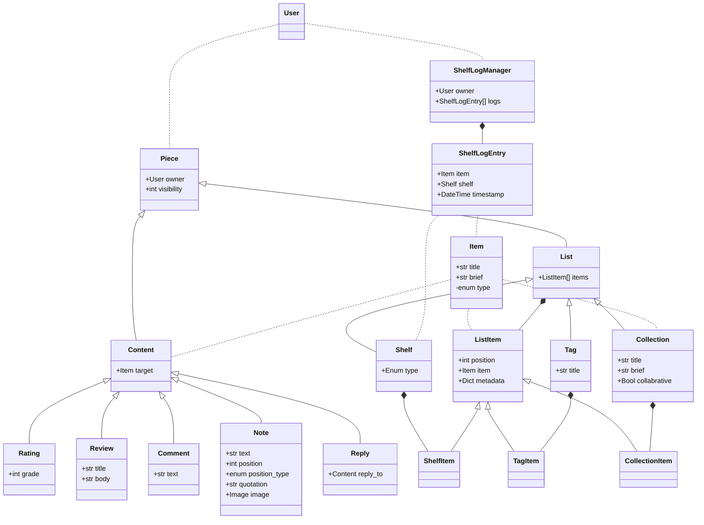

Journal
=======

Data Model
----------

```mermaid
classDiagram
User .. Piece

class Piece {
    +User owner
    +int visibility
}

class Item {
    +str title
    +str brief
    -enum type
}
Piece <|-- Content
Item .. Content
class Content {
    +Item target
}
Content <|-- Rating
class Rating {
    +int grade
}
Content <|-- Review
class Review {
    +str title
    +str body
}
Content <|-- Comment
class Comment {
    +str text
}
Content <|-- Note
class Note {
    +str text
    +int position
    +enum position_type
    +str quotation
    +Image image

}
Content <|-- Reply
class Reply {
    +Content reply_to
}
Piece <|-- List
class List{
    +ListItem[] items
}
Item .. ListItem
List *-- ListItem
class ListItem {
    +int position
    +Item item
    +Dict metadata
}
List <|-- Collection
Item .. Collection
class Collection {
    +str title
    +str brief
    +Bool collabrative
}
List <|-- Tag
class Tag {
    +str title
}
List <|-- Shelf
class Shelf {
    +Enum type
}
User .. ShelfLogManager
class ShelfLogManager {
    +User owner
    +ShelfLogEntry[] logs
}
ShelfLogManager *-- ShelfLogEntry
class ShelfLogEntry {
    +Item item
    +Shelf shelf
    +DateTime timestamp
}
ShelfLogEntry .. Item
ShelfLogEntry .. Shelf

Shelf *-- ShelfItem
ListItem <|-- ShelfItem

ListItem <|-- TagItem
ListItem <|-- CollectionItem

Tag *-- TagItem
Collection *-- CollectionItem
```
