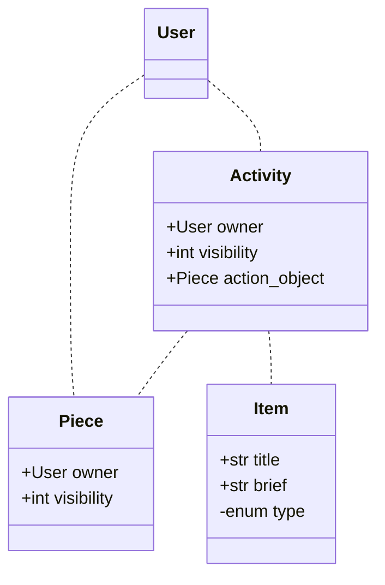

Social
======

Data Modal
----------

Activities
----------
Activity data may be used for:
 1. time line view of user and her friends
 2. chronological view of user's action about an item
 3. ActivityStreams `OrderedCollection` for ActivityPub

However, 2 is currently implemented separately via `ShelfLogManager` in `journal` app, because users may want to change these records manually.

Local Timeline
--------------
| Local Timeline Activities | action object class |
| ------------------------- | ------------------- |
| Add an Item to Shelf      | ShelfMember         |
| Create a Collection       | Collection          |
| Like a Collection         | Like                |
| Create a Review           | Review              |

Activity Streams
----------------
These are list of activities should be either shown in the site or delivered as ActivityStreams or both:

 - `Add` / `Remove` an *Item* to / from a *List*:
     + add / remove *Item* to / from a user *Collection*
     + mark *Item* as wishlist / progress / complete, which are essentially add to / remove from user's predefined *Collection*
 - `Create` / `Update` / `Delete` a user *Collection*
 - `Create` / `Update` / `Delete` a *Content* with an `Object Link` to *Item*
     + `Create` / `Update` / `Delete` a *Comment* or *Review*
     + `Create` / `Update` / `Delete` a *Quote* or *Note*
 - `Create` / `Update` / `Delete` a *Reply* to another *Content*
 - `Announce` / `Like` a *Content* / *Collection*, or `Undo` that
 - Social Graph interaction
     + `Follow`/`Unfo` `Follow`
     + `Accept`/`Reject`
     + `Block`/`Undo` `Block`

Supporting these activities above will be essential to a reasonable ActivityPub server implementation.

There are additional activities not made into ActivityPub MVP but technically possible to support in future:
  - `Create` / `Update` / `Delete` a *Content*  in different flavors, without link to *Item*
      * `Note` or `Article` without link to *Item*
      * DM (`Note`)
      * `Question`
      * `Article`
      * `Page`
      * `Image`
      * `Audio`
      * `Video`
      * `Event`
  - `Add` `Content` to / `Remove` `Content` from a user *Collection*
      * *Pin* / *Unpin*
  - `Move`/`Delete` account

ActivityPub
-----------

TBA

References:
 - https://www.w3.org/TR/activitypub/
 - https://www.w3.org/TR/activitystreams-core/
 - https://www.w3.org/TR/activitystreams-vocabulary/
 - https://www.w3.org/TR/json-ld/
 - https://codeberg.org/fediverse/fep/src/branch/main/feps/fep-e232.md
 - https://socialhub.activitypub.rocks/t/guide-for-new-activitypub-implementers/479
 - https://docs.joinmastodon.org/spec/activitypub/
 - https://docs.joinbookwyrm.com/activitypub.html
 - https://github.com/Podcastindex-org/podcast-namespace/blob/main/proposal-docs/social/social.md#socialinteract-element
 - https://dev.funkwhale.audio/funkwhale/funkwhale/-/tree/develop/docs/developer_documentation/federation
 - https://github.com/inventaire/inventaire/issues/187
 - https://github.com/inventaire/inventaire/issues/533
