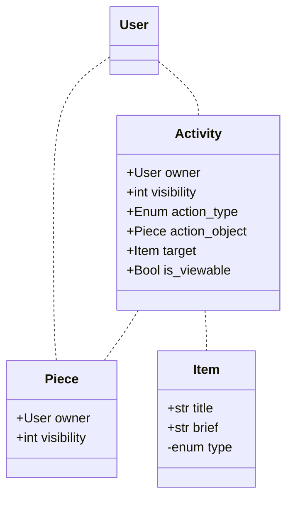

Social
======

Data Modal
----------

Activities
----------
Activity is used for two main purposes:
 - Generate chronological view for users
 - Generate ActivityStreams OrderedCollection for ActivityPub interactions

ActivityPub
-----------

TBA

References:
 - https://www.w3.org/TR/activitypub/
 - https://www.w3.org/TR/activitystreams-core/
 - https://www.w3.org/TR/activitystreams-vocabulary/
 - https://www.w3.org/TR/json-ld/
 - https://codeberg.org/fediverse/fep/src/branch/main/feps/fep-e232.md
 - https://socialhub.activitypub.rocks/t/guide-for-new-activitypub-implementers/479
 - https://docs.joinmastodon.org/spec/activitypub/
 - https://docs.joinbookwyrm.com/activitypub.html
 - https://github.com/Podcastindex-org/podcast-namespace/blob/main/proposal-docs/social/social.md#socialinteract-element
 - https://dev.funkwhale.audio/funkwhale/funkwhale/-/tree/develop/docs/developer_documentation/federation
 - https://github.com/inventaire/inventaire/issues/187
 - https://github.com/inventaire/inventaire/issues/533
